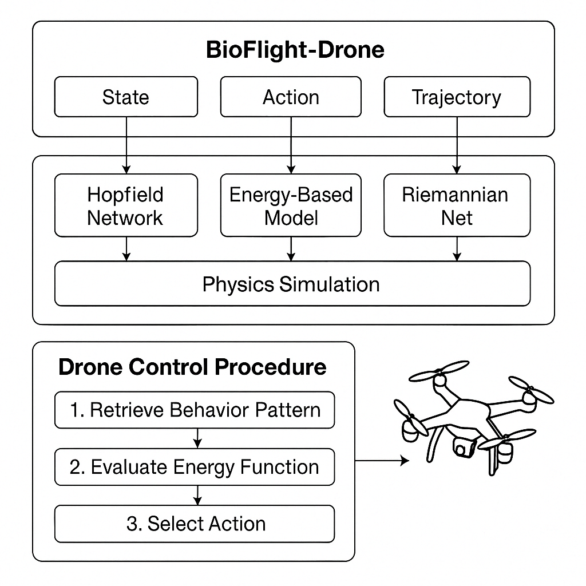

# BioFlight-Drone (drone_poly)

**BioFlight-Drone** is an in progress bio-inspired machine learning system that mimics the energy-efficient flight behavior of biological creatures (e.g., birds) using energy-based models, Hopfield networks, Riemannian geometry, and physics-informed simulation. The system enables drones to learn, remember, and execute efficient behaviors by minimizing potential energy usage, drawing parallels to concepts like protein folding and natural flight evolution.

---


## Introduction & Motivation

The flight behavior of birds reflects millions of years of evolutionary optimization, resulting in motion patterns that are neither random nor brute-forced, but instead governed by the principles of **physics**, **thermodynamics**, and **behavioral memory**. These creatures conserve energy through highly efficient maneuvers, adapting dynamically to environmental conditions while minimizing energetic cost. Inspired by this, **BioFlight-Drone** proposes a learning framework in which an autonomous aerial agent acquires and executes biologically plausible behaviors through energy-aware decision-making.

Rather than relying on conventional optimization techniques, this system employs **Hopfield networks** to encode and recall idealized motion patterns as **attractor states** within a dynamic energy landscape. These memory representations are complemented by **Energy-Based Models (EBMs)** that evaluate the energetic cost of possible actions, integrating both internal hardware constraints and external environmental factors. Grounded in the **Second Law of Thermodynamics**, the drone's behavioral evolution is framed as a continuous descent toward **stable, low-energy configurations**, analogous to **protein folding**, which naturally converges to energetically favorable structures without exhaustive search.

This approach enables the drone not merely to imitate biological motion, but to embody the **physical intelligence of nature**, selecting actions that align with the intrinsic constraints of its environment and design. The result is a system that learns to fly not just like a bird — but in the way **physics dictates an efficient agent should**.

---

## Overview

**BioFlight-Drone** is a modular learning framework designed to train autonomous drones to behave intelligently and efficiently in real-time. Inspired by biological systems, particularly avian flight, it focuses on minimizing energy expenditure during operation. It integrates:

-   **Hopfield Networks:** For storing and recalling stable behavioral patterns (e.g., glide, flap, turn) as memory attractors.
-   **Energy-Based Models (EBMs):** For predicting optimal actions and evaluating trajectory efficiency based on a composite energy function.
-   **Riemannian Geometry:** Using libraries like [CUSP](https://github.com/karish-grover/cusp) to analyze the 'shape' and similarity of motion trajectories on product manifolds.
-   **Lyapunov-based Stability Analysis:** To ensure learned control policies converge to stable, energy-efficient states.
-   **Physics Simulation:** Utilizing environments like `gym-pybullet-drones` and potentially `AirSim` for realistic drone-environment interaction.

---

## Project Goals

-   Mimic bird flight behavior using data-driven memory models (Hopfield Networks).
-   Minimize drone energy consumption through bio-physical learning principles (EBMs).
-   Simulate complex drone-environment interactions using realistic physics engines (PyBullet, AirSim).
-   Incorporate Riemannian geometry to understand and leverage the underlying structure (shape, curvature) of drone motion.
-   Develop control strategies with provable stability guarantees using Lyapunov theory.




##  Mathematical Foundation

### 1. Behavioral Memory via Hopfield Networks

We model distinct behavioral patterns (e.g., specific flight maneuvers) `x ∈ {−1, 1}^N` as stable attractor states in a high-dimensional energy landscape defined by the Hopfield energy function:


```
E(x) = -½ ∑_{i,j} w_ij x_i x_j = -½ xᵀ W x

```
Here, `W` is a symmetric weight matrix (`w_ij = w_ji`), typically trained using **Hebbian learning** on a set of `P` prototype patterns `x^(p)`:

```
W = ∑_{p=1}^{P} x^(p) x^(p)ᵀ,    with diagonal elements    w_ii = 0
```
The network dynamics evolve over discrete time `t` to minimize this energy, converging to the nearest stored pattern:

```
x_i(t+1) = sign( ∑_j w_ij x_j(t) )
```

---

### 2. Action Selection via Energy-Based Modeling (EBM)

The drone's decision-making process minimizes a composite energy function `E_total`, balancing multiple objectives:

```
E_total = α * E_behavior + β * E_hardware + γ * E_environment
```

Where:

- `E_behavior`: Measures deviation from ideal, stored behaviors (e.g., Hopfield energy difference or cosine distance to attractors).
- `E_hardware`: Estimates the physical energy cost of an action (e.g., motor torque, battery drain rate).
- `E_environment`: Accounts for external factors influencing energy cost (e.g., wind resistance, air density, terrain slope).
- `α, β, γ`: Weighting coefficients determining the relative importance of each factor.

The drone learns a policy (e.g., via reinforcement learning or direct optimization) to select actions that descend this energy landscape, promoting efficient and biologically plausible behavior.

---

### 3. Trajectory Representation via Riemannian Geometry

Using tools like [**CUSP**](https://github.com/karish-grover/cusp), drone trajectories (sequences of states like position, velocity, orientation) are embedded onto **product manifolds**:

```
𝓜 = ℍ^d₁ × ℍ^d₂ × 𝕊^d₃ × ℝ^d₄
```
This representation allows us to treat trajectories as points or sequences on curved spaces (combinations of Hyperbolic ℍ, Spherical 𝕊, and Euclidean ℝ spaces). Properties like:

- **Geodesic distance**: Measures the intrinsic similarity between trajectories.
- **Riemannian curvature and Laplacians**: Capture the geometric structure of motion patterns.

This geometric perspective enables novel methods for trajectory classification, clustering, and learning shape-aware control policies. Trajectories can be represented as graphs `G = (V, E)` where nodes `V` are states and edges `E` represent transitions, analyzed using Spectro-Riemannian Graph Neural Networks.

---

### 4. Stability via Lyapunov Functions

To ensure that the learned drone behaviors are stable and reliably converge to desired states (e.g., energy-efficient gliding), we incorporate **Lyapunov stability theory**. We seek to find or learn a control policy `π(x)` and a Lyapunov function `V(x)` such that for the system dynamics `ẋ = f(x, π(x))`:

1. `V(x) > 0` for all states `x ≠ x*`, and `V(x*) = 0`.
2. The time derivative of `V(x)` along system trajectories is negative definite:
```
dV(x)/dt = ∇V(x)ᵀ f(x, π(x)) < 0    ∀ x ≠ x*
```
Satisfying these conditions guarantees **asymptotic stability** – the system will always return to the desired state `x*` (e.g., a stable flight pattern) if perturbed. This can be integrated into the learning objective or used to synthesize controllers via techniques like **Control Barrier Functions (CBFs)**.

---

## System Architecture

| Module                     | Description                                                                 | Core Technologies        |
| :------------------------- | :-------------------------------------------------------------------------- | :----------------------- |
| `models/hopfield.py`       | Implements Hopfield network for storing/recalling behavior patterns.        | NumPy/PyTorch            |
| `models/energy_model.py`   | Predicts $E_{\text{total}}$ for state-action pairs (e.g., using CNNs/MLPs). | PyTorch, EBM principles  |
| `models/riemannian_net.py` | Encodes trajectory shapes using Spectro-Riemannian GNNs via CUSP.           | PyTorch, CUSP            |
| `agents/drone_agent.py`    | Integrates outputs from models to select actions and control the drone.     | Python                   |
| `simulation/pybullet_wrapper.py` | Interfaces with the `gym-pybullet-drones` simulation environment.         | PyBullet, Gym            |
| `simulation/airsim_interface.py` | (Optional) Interface for high-fidelity simulation with AirSim.            | AirSim API               |
| `training/train_memory.py` | Script for training the Hopfield network weights on behavior data.          | PyTorch                  |
| `training/train_energy_model.py` | Script for training the EBM to predict composite energy.                | PyTorch                  |
| `utils/`                   | Helper functions for data loading, visualization, etc.                      | Matplotlib, NumPy, etc.  |
| `config/`                  | Configuration files (hyperparameters, model paths).                         | YAML                     |
| `data/`                    | Datasets (e.g., bird trajectories, simulation logs).                       | JSON, CSV, etc.          |
| `external/`                | Submodules for external dependencies (CUSP, gym-pybullet-drones).           | Git Submodules           |

---

## Project Structure

```
bioflight-drone/
├── main.py                 # Main execution script
├── requirements.txt        # Python dependencies
├── README.md               # This file
│
├── config/
│   └── config.yaml         # Configuration (hyperparameters, paths)
│
├── data/
│   ├── test_inputs.json    # Sample inputs for Hopfield testing
│   └── bird_behavior_dataset/ # Placeholder for real/synthetic data
│
├── models/
│   ├── __init__.py
│   ├── hopfield.py         # Hopfield network implementation
│   ├── energy_model.py     # Energy-Based Model implementation
│   └── riemannian_net.py   # Riemannian GNN (using CUSP)
│
├── agents/
│   ├── __init__.py
│   └── drone_agent.py      # Drone control logic
│
├── simulation/
│   ├── __init__.py
│   ├── pybullet_wrapper.py # Interface for PyBullet sim
│   ├── airsim_interface.py # Interface for AirSim (optional)
│   └── mock_env.py         # Simple test environment
│
├── training/
│   ├── __init__.py
│   ├── train_energy_model.py # Script to train EBM
│   ├── train_memory.py     # Script to train Hopfield memory
│   └── evaluate.py         # Evaluation scripts and metrics
│
├── utils/
│   ├── __init__.py
│   ├── data_loader.py      # Data loading utilities
│   └── visualizer.py       # Plotting and animation tools
│
└── external/
    ├── gym-pybullet-drones/ # Git submodule for the PyBullet drone env
    └── cusp/                # Git submodule for Spectro-Riemannian GNNs
```

---

## Setup and Installation

### 1. Clone the Repository

```bash
git clone [https://github.com/yourusername/drone_poly.git](https://github.com/yourusername/drone_poly.git)
cd drone_poly
```

### 2. Create Conda Environment

It is recommended to use a Conda environment to manage dependencies.

```bash
conda create -n bioflight python=3.10 -y
conda activate bioflight
```

### 3. Install Python Dependencies

Install the required Python packages from `requirements.txt`.

```bash
pip install -r requirements.txt
```

### 4. Initialize External Dependencies (Git Submodules)

This project relies on external libraries included as Git submodules.

```bash
git submodule update --init --recursive
```

This will clone `gym-pybullet-drones` and `cusp` into the `external/` directory.

### 5. Install Submodule Dependencies

Install dependencies specific to the submodules.

```bash
# Install CUSP requirements
cd external/cusp
pip install -r requirements.txt
cd ../.. # Return to the project root directory

# gym-pybullet-drones typically installs with the main requirements.txt
# If needed, follow installation instructions in external/gym-pybullet-drones/README.md
```

---

## Quick Start

### 1. Test Hopfield Memory

Run a simple test to train the Hopfield network on predefined patterns and test recall.

```bash
python training/train_memory.py
```

### 2. Train the Energy-Based Model

Train the EBM using synthetic or real trajectory data (ensure data is available in `data/`).

```bash
python training/train_energy_model.py
```

### 3. Run Simulation in PyBullet

Launch the drone simulation using the learned agent policy in the PyBullet environment.

```bash
python simulation/pybullet_wrapper.py
```
*(Note: This might require `main.py` or a specific run script depending on your final implementation)*

---

## NVIDIA GPU Acceleration and Docker

This project leverages NVIDIA GPUs for accelerating training and potentially simulation.

### PyTorch with CUDA

All PyTorch-based models (Hopfield, EBM, Riemannian Nets) are configured to use CUDA if an NVIDIA GPU and the appropriate PyTorch build are available.

```python
# Example check within Python scripts
import torch
device = torch.device("cuda" if torch.cuda.is_available() else "cpu")
print(f"Using device: {device}")
if torch.cuda.is_available():
    print(f"Device name: {torch.cuda.get_device_name(0)}")

# Ensure models and tensors are moved to the device
# model = YourModel().to(device)
# data = data.to(device)
```

### Recommended NVIDIA Stack

-   **CUDA Toolkit:** Necessary for GPU computation. Version should match PyTorch build.
-   **cuDNN:** Optimized library for deep neural network primitives.
-   **NCCL:** For efficient multi-GPU communication (if using distributed training).
-   **NVIDIA Driver:** Ensure you have a compatible driver installed.

### Docker for Reproducibility

A `Dockerfile` is provided for building a containerized environment with GPU support via the NVIDIA Container Toolkit.

```Dockerfile
# Use an official NVIDIA CUDA base image matching your PyTorch CUDA version
# Example: PyTorch for CUDA 12.1
FROM nvidia/cuda:12.1.1-cudnn8-runtime-ubuntu22.04

# Avoid prompts during package installation
ENV DEBIAN_FRONTEND=noninteractive

# Install essential packages and Python
RUN apt-get update && apt-get install -y --no-install-recommends \
    python3.10 python3.10-venv python3-pip git wget unzip libgl1-mesa-glx \
    && rm -rf /var/lib/apt/lists/*

# Make python3.10 the default python3
RUN update-alternatives --install /usr/bin/python3 python3 /usr/bin/python3.10 1

# Install PyTorch matching the CUDA version in the base image
RUN pip3 install --no-cache-dir torch torchvision torchaudio --index-url [https://download.pytorch.org/whl/cu121](https://download.pytorch.org/whl/cu121)

# Copy project code
COPY . /app
WORKDIR /app

# Install project dependencies
RUN pip3 install --no-cache-dir -r requirements.txt

# Initialize and install submodule dependencies
RUN git submodule update --init --recursive
RUN cd external/cusp && pip3 install --no-cache-dir -r requirements.txt && cd ../..

# Set environment variable for Python path if needed
# ENV PYTHONPATH "${PYTHONPATH}:/app"

# Default command (optional)
# CMD ["python3", "main.py"]
```

**Build and Run with NVIDIA Docker:**

1.  Install [NVIDIA Container Toolkit](https://docs.nvidia.com/datacenter/cloud-native/container-toolkit/install-guide.html).
2.  Build the Docker image:
    ```bash
    docker build -t bioflight-gpu .
    ```
3.  Run the container with GPU access:
    ```bash
    docker run --gpus all -it --rm bioflight-gpu bash
    ```
    (Replace `bash` with your desired command, e.g., `python3 training/train_energy_model.py`)

---

## Tasks & Experiments

Current and planned experiments include:
-   Demonstrating trajectory convergence towards low-energy states using EBM-guided control.
-   Classifying different drone flight phases (e.g., takeoff, hover, glide, landing) using Riemannian GNNs on trajectory data.
-   Evaluating the energy efficiency of the learned controller compared to baseline controllers or ground-truth bird data.
-   Testing the stability and robustness of drone behaviors governed by Lyapunov-stable control modules.
-   Comparing performance in PyBullet vs. higher-fidelity simulators like AirSim or Isaac Sim.

---

## Future Work & Directions

-   **Integrate Real-World Data:** Incorporate GPS and motion capture data from actual birds or highly realistic drone flights.
-   **Online Adaptation:** Develop mechanisms for neuroplasticity in the Hopfield memory or adaptive EBMs to allow the drone to learn new behaviors online.
-   **Advanced Simulation:** Fully integrate with AirSim or NVIDIA Isaac Sim for photorealistic rendering and complex sensor simulation (e.g., camera-based imitation learning).
-   **Model-Free Lyapunov Control:** Explore learning controllers with stability guarantees directly from data using techniques like Control Barrier Functions (CBFs) learned via RL.
-   **Hardware Implementation:** Test the developed algorithms on physical drone hardware.
-   **Self-Organizing Dynamics:** Investigate how complex, coordinated behaviors can emerge from the interaction of these components, potentially leveraging manifold embeddings.
-   **Adaptive Control:** Design control systems that explicitly adapt to changing environmental conditions using Riemannian geometry insights.

---

## License

The core code of this project is licensed under the MIT License. See the `LICENSE` file for details.

External dependencies included as submodules (`external/gym-pybullet-drones`, `external/cusp`) are subject to their own respective licenses. Please consult the license files within those directories.

---

## Citation

If you use this work or build upon it in your research, please consider citing the relevant components:

**For the Riemannian Geometry Aspects (CUSP):**
```bibtex
@inproceedings{grover2024cusp,
 title={CUSP: Curriculum Spectro-Riemannian Graph Neural Networks},
 author={Karish Grover and Abdelrahman Ahmed and Mustafa Coskun and Nikhil Singh and Siyu Chen and Ambuj Singh and Inderjit S Dhillon},
 booktitle={The Twelfth International Conference on Learning Representations (ICLR)},
 year={2024},
 url={[https://openreview.net/forum?id=Tmmzsp1qNz](https://openreview.net/forum?id=Tmmzsp1qNz)}
}
```
*(Note: The BibTeX provided previously had a future year and different title/arXiv link. Using the official ICLR 2024 publication details for CUSP.)*

**For the Simulation Environment:**
```bibtex
@misc{panerati2021learning,
    title={Learning to Fly -- A Gym Environment for Quadrotor Control},
    author={Jacopo Panerati and He Kong and Kyle Dunlap and Christopher Agia and Daniel T. Paley and Mikael-\'Elias F. Bouges and W. Nathan Greene and SiQi Zhou and Florian T. Mueller and Spencer N. Gibb and Brian L. Zhou and Adam W. Frew and Gregory S. Chirikjian},
    year={2021},
    eprint={2103.03100},
    archivePrefix={arXiv},
    primaryClass={cs.RO}
}
```

**For this Project (BioFlight-Drone):**
*(in progress)*
```bibtex
@misc{Sensoy_bioflight_2025,
  title={BioFlight-Drone: Bio-Inspired Energy-Efficient Drone Control via {Hopfield}, {EBMs}, and {Riemannian Geometry}},
  author={Elida Sensoy},
  year={2025},
  publisher={GitHub},
  journal={GitHub repository}, 
  note={(In Development)}
}
```
